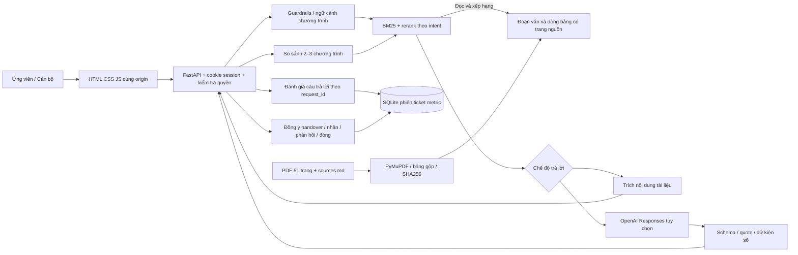
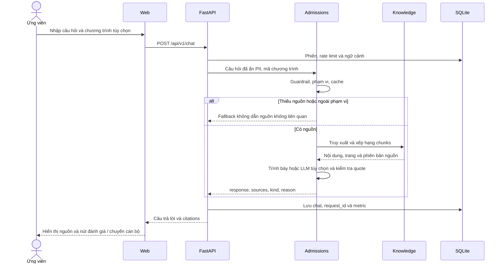
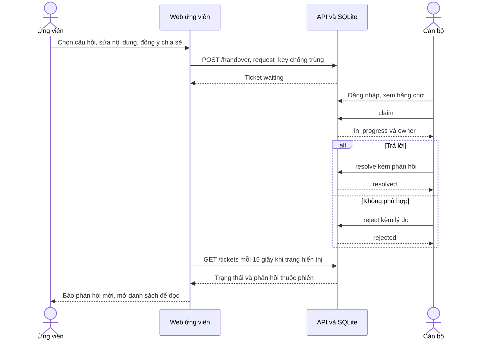

# Kiến trúc MVP triển khai — 04/10/2026

Không có Next.js/pgvector trong demo local. Xem [README MVP](../README-MVP.md) cho phạm vi nguồn và giới hạn đánh giá. Các file agent LangGraph mẫu không được gọi trong API chat MVP.

| Thành phần | Triển khai |
|---|---|
| Giao diện | `src/web/`, JavaScript gọi API cùng origin |
| API và quyền truy cập | `src/api/routes.py`, cookie HttpOnly/SameSite, kiểm tra phiên sở hữu |
| Nguồn và retrieval | `src/services/knowledge.py`, PyMuPDF, BM25, rerank intent, phiên bản SHA256 |
| Trả lời và guardrails | `src/services/admissions.py`, trích nguồn hoặc OpenAI Responses có kiểm tra quote |
| Lưu trữ và handover | `src/services/store.py`, SQLite, nhận độc quyền, idempotency, TTL |
| Đánh giá | `eval/cases.json`, `scripts/evaluate_mvp.py`, báo cáo nhãn tự động và trường duyệt thủ công |

## Data flow — chat và trích nguồn

## Data flow — handover end-to-end

## Nguồn, persistence và giới hạn

PDF và `sources.md` được đọc lúc khởi động; PyMuPDF tạo chunks có số trang và SHA256, giữ chỉ mục trong process và ghi `data/processed/knowledge.json` để kiểm tra. Dữ liệu xử lý tái tạo được. SQLite lưu phiên, lịch sử chat, đánh giá, ticket, metric và hạn mức; chỉ lưu hash token đăng nhập. Database và `.env` không commit.

Cán bộ chỉ nhận nội dung ticket ứng viên đồng ý gửi, không nhận nguyên lịch sử chat. Dấu phản hồi đã xem lưu trong localStorage; dữ liệu phản hồi và quyền xem ticket nằm trên backend. Cache và chỉ mục theo process; chưa kiểm chứng nhiều worker hoặc tải cao. Kiểm tra quote/numbers không thay thế xác minh độ chính xác ngữ nghĩa.

Tài liệu liên quan: [README MVP](../README-MVP.md), [manual evidence](../eval/manual-tests.md).
