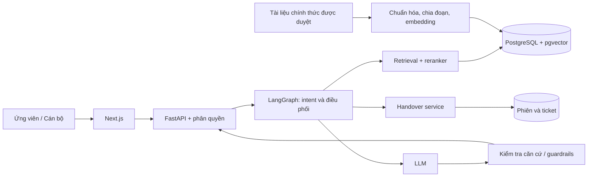

# PRD — Trợ lý tuyển sinh X

**EDU-12 · Khối C (AI Vận hành) · Nhóm 1009 · Mã đội T051 · Gate G1 · Phiên bản 1.1**

Cập nhật: 04/10/2026. Hạn nộp G1 theo đề bài: 20/09/2026, 23:59 (giờ Việt Nam). Ngày cập nhật không thay đổi hạn nộp; trạng thái nộp/pass chưa được xác minh. PRD là tài liệu chuẩn về phạm vi và nghiệm thu; brief tóm tắt PRD, UI flow đặc tả trải nghiệm tương ứng. Thay đổi phạm vi phải cập nhật đồng thời các tài liệu liên quan.

Trạng thái: đề xuất thiết kế để chốt phạm vi. Chưa triển khai, chưa có số liệu đánh giá. Trường X là tên giữ chỗ theo đề bài; chưa xác định trường hoặc nguồn tuyển sinh thực tế. Các con số về chất lượng bên dưới là mục tiêu, không phải kết quả.

## 1. Vấn đề, mục tiêu và người dùng

Ứng viên cần câu trả lời nhanh, có căn cứ và hướng dẫn bước tiếp theo. Cán bộ cần giảm câu hỏi lặp và tập trung vào ngoại lệ. Sản phẩm cung cấp hỏi đáp 24/7 về ngành, điều kiện, học phí, học bổng và quy trình; handover bảo đảm các câu hỏi thiếu căn cứ hoặc nhạy cảm được người có thẩm quyền xử lý.

| Vai trò | Nhu cầu | Quyền |
|---|---|---|
| Ứng viên | Hỏi, xem nguồn, biết bước tiếp theo, yêu cầu cán bộ | Dùng phiên ẩn danh; chỉ xem hội thoại và yêu cầu của mình |
| Cán bộ tuyển sinh | Nhận và giải quyết ngoại lệ | Đăng nhập; truy cập hàng chờ được phân quyền; phản hồi và cập nhật trạng thái |

Không mặc định yêu cầu ứng viên tạo tài khoản hoặc cung cấp thông tin định danh. Việc tạo tài khoản cán bộ và cập nhật kho nguồn do người vận hành được ủy quyền thực hiện, chưa cần một giao diện quản trị thứ ba trong MVP.

## 2. Phạm vi và mức ưu tiên

**P0 — MVP:** chat có nguồn; hướng dẫn hồ sơ theo tài liệu; hội thoại trong phiên; phát hiện câu vượt phạm vi/nhạy cảm; handover; hàng chờ và phản hồi cán bộ; bộ test có nhãn và báo cáo KPI. Web app hai vai trò được deploy ở giai đoạn xây dựng sau G1.

**P1 — nâng cao:** cá nhân hóa qua hồ sơ tự nguyện; gợi ý bước tiếp theo và nurture có đồng ý; dashboard engagement; caching câu hỏi chung với cơ chế vô hiệu hóa khi nguồn đổi. Guardrail chống bịa là P0, không chờ đến nâng cao.

**Ngoài phạm vi:** quyết định tuyển sinh, dự đoán chắc chắn trúng tuyển, nhận hồ sơ/thanh toán chính thức, kết nối tất cả kênh truyền thông, tự động gửi tiếp thị ngoài phiên khi chưa được đồng ý.

## 3. Yêu cầu chức năng và nghiệm thu

| ID | User story / Yêu cầu | Tiêu chí nghiệm thu dự kiến |
|---|---|---|
| FR-01 | Ứng viên hỏi về tuyển sinh | Đầu vào trống không gọi AI; câu hỏi hợp lệ hiển thị trạng thái xử lý và câu trả lời hoặc fallback; lỗi có nút thử lại |
| FR-02 | Ứng viên kiểm tra căn cứ | Mỗi câu trả lời chứa thông tin tuyển sinh phải có nguồn hỗ trợ tương ứng: tên tài liệu, URL, mục/trang nếu có, kỳ áp dụng; bấm được link nguồn |
| FR-03 | Trợ lý làm rõ nhu cầu | Khi thiếu ngành/bậc/kỳ cần cho câu trả lời, hỏi làm rõ; không tự suy đoán; người dùng có thể bỏ chọn hoặc đổi thông tin trong phiên |
| FR-04 | Ứng viên xem hướng dẫn nộp hồ sơ | Checklist và link nộp lấy từ nguồn đã duyệt; không có nguồn thì không sinh hạn, giấy tờ hoặc điều kiện giả |
| FR-05 | Trợ lý phát hiện ngoại lệ | Thiếu nguồn, nguồn mâu thuẫn/hết hiệu lực, câu nhạy cảm hoặc yêu cầu cam kết dẫn đến thông báo giới hạn và đề nghị cán bộ; không trả lời quyết định trúng tuyển |
| FR-06 | Ứng viên đồng ý handover | Xem trước nội dung chuyển, đồng ý rồi mới tạo yêu cầu; có mã và trạng thái; hủy không tạo ticket; thông tin liên hệ là tùy chọn nếu muốn được liên lạc ngoài phiên |
| FR-07 | Cán bộ xử lý yêu cầu | Chỉ cán bộ đăng nhập và có quyền xem hàng chờ; nhận xử lý, phản hồi, đóng; ứng viên cùng phiên xem được phản hồi; người khác không truy cập được ticket bằng cách đoán ID |
| FR-08 | Duy trì hội thoại | Câu hỏi tiếp nối dùng ngành/kỳ đã chọn trong phiên; xóa phiên xóa ngữ cảnh theo chính sách, không trộn dữ liệu giữa ứng viên |
| FR-09 | Kiểm soát nguồn | Tài liệu trước khi lập chỉ mục phải có người xác minh, URL chính thức, kỳ áp dụng, phiên bản; nguồn bị thu hồi không được dùng để sinh câu trả lời mới |
| FR-10 | Đo chất lượng | Báo cáo tái lập được từ phiên bản bộ test, nguồn, model và prompt; ghi riêng answer rate, accuracy, lỗi bịa nghiêm trọng, handover, độ trễ và chi phí |
| FR-11 (P1) | Cá nhân hóa/nurture | Chỉ lưu hồ sơ và gửi nhắc khi người dùng chủ động đồng ý; có cách rút lại; không dùng đặc điểm nhạy cảm để suy diễn cơ hội tuyển sinh |
| FR-12 (P1) | Dashboard/caching | Engagement dùng dữ liệu tối thiểu; cache chỉ câu chung, gắn phiên bản nguồn và kỳ tuyển sinh, không dùng chung câu trả lời có thông tin cá nhân |

## 4. Luồng nghiệp vụ

1. Ứng viên mở chat, đọc giới hạn và nhập câu hỏi; có thể chọn ngành/kỳ quan tâm.
2. Hệ thống kiểm tra đầu vào và ý định, yêu cầu làm rõ nếu thiếu thông tin thiết yếu.
3. Truy xuất tài liệu theo kỳ/nguồn đã duyệt, rerank, đánh giá mức đủ căn cứ. Ngưỡng truy xuất được hiệu chỉnh bằng tập development; không coi điểm tự tin của LLM là bảo đảm chính xác.
4. Nếu đủ căn cứ, sinh câu trả lời có nguồn, kiểm tra các khẳng định và gợi ý bước tiếp theo. Nếu không, fallback hoặc đề nghị handover.
5. Khi ứng viên đồng ý, tạo ticket có tóm tắt đã xem trước và ngữ cảnh tối thiểu; không hứa thời gian phản hồi khi chưa có SLA từ trường.
6. Cán bộ nhận xử lý → phản hồi → đóng. Ứng viên xem trạng thái/phản hồi trong phiên; nếu mất phiên và không cung cấp kênh liên hệ thì chưa hỗ trợ khôi phục ở MVP.

Trạng thái ticket: `waiting → in_progress → resolved`. Lỗi tạo ticket phải báo rõ chưa gửi và cho thử lại; retry sử dụng khóa idempotency để tránh trùng.

## 5. Dữ liệu, bảo mật và guardrails

- Nguồn: website, quy chế, đề án, thông báo tuyển sinh chính thức được trường xác nhận. Chưa có URL cụ thể; không sử dụng tài liệu minh họa như nguồn thật.
- Metadata: `document_id`, tên, URL, mục/trang, kỳ tuyển sinh, phiên bản, ngày xác minh, người xác minh, hiệu lực. Nguồn mâu thuẫn cần cán bộ quyết định, AI không tự chọn một mức học phí hay hạn nộp.
- Dữ liệu phiên: ID ngẫu nhiên, ngành/bậc/kỳ tự chọn, hội thoại cần thiết. Không bắt buộc tên thật, CCCD, địa chỉ, số điện thoại hoặc hồ sơ học tập.
- Handover: ticket ID, phiên sở hữu, tóm tắt, nội dung được đồng ý chuyển, trạng thái, người xử lý, phản hồi và mốc thời gian. Liên hệ tùy chọn phải tách khỏi log phân tích.
- Chính sách lưu trữ đề xuất, cần trường duyệt trước pilot: phiên ẩn danh hết hạn sau 24 giờ không hoạt động; ticket xóa/ẩn danh trong 30 ngày sau khi đóng; chỉ giữ thống kê tổng hợp không định danh lâu hơn. Không đưa dữ liệu liên hệ vào cache hay telemetry AI.
- HTTPS khi deploy; khóa API ở môi trường server; kiểm tra quyền trên từng ticket; che dữ liệu cá nhân trong log; giới hạn tần suất và kích thước đầu vào.
- Xem tài liệu truy xuất và prompt người dùng là dữ liệu không đáng tin; không làm theo chỉ dẫn thay đổi chính sách/tiết lộ bí mật nằm trong tài liệu. Không dùng công cụ có quyền quyết định tuyển sinh.
- Không bảo đảm trúng tuyển/học bổng; không suy diễn theo giới tính, dân tộc, điều kiện kinh tế. Thông tin điều kiện chính thức phải được dẫn đúng nguồn, áp dụng nhất quán.

## 6. Kiến trúc dự kiến

Đây là thiết kế đề xuất, không mô tả tính năng đã có trong code. API dự kiến: `POST /chat`, `POST /handover`, `GET /tickets/{id}`, `GET /staff/tickets`, `POST /staff/tickets/{id}/claim`, `POST /staff/tickets/{id}/reply`, `POST /staff/tickets/{id}/resolve`. Các route staff bắt buộc xác thực; route ứng viên kiểm tra quyền phiên.

Docker và cloud dùng khi triển khai. Model, embedding và reranker được chọn sau benchmark tiếng Việt về chất lượng/chi phí. Mục tiêu kỹ thuật đề xuất: p95 phản hồi hoàn chỉnh ≤10 giây tại 20 phiên đồng thời, giới hạn 2.000 ký tự mỗi câu hỏi; cần đo thực tế và điều chỉnh cùng ngân sách. Có timeout, thông báo lỗi và handover thay vì chờ vô hạn. Theo dõi token và chi phí mỗi lượt; chốt trần ngân sách trước pilot.

## 7. Kế hoạch đánh giá và KPI

Đề xuất tối thiểu 100 câu có nhãn, bao phủ ngành/điều kiện, hồ sơ/hạn, học phí, học bổng, hội thoại tiếp nối và trường hợp phải từ chối/handover. Cán bộ xác nhận đáp án, nguồn, kỳ và hành vi kỳ vọng. Có tập development riêng để chỉnh hệ thống; đóng băng test trước đánh giá, không chỉnh ngưỡng trên test.

| Chỉ số | Định nghĩa | Mục tiêu |
|---|---|---|
| Answer rate | Số câu trong nhóm hỏi đáp tuyển sinh hợp lệ được AI trả lời thực chất, không chuyển cán bộ / tổng câu của nhóm này. Câu hỏi làm rõ đơn thuần chưa tính trả lời | ≥70% |
| Accuracy | Số câu trả lời AI được chấm đúng, đủ, có nguồn hỗ trợ / tổng câu AI đã trả lời trong nhóm trên. Nếu không có câu trả lời, báo N/A và không đạt | ≥85% |
| Giảm tải cán bộ | `(B − P) / B × 100%`; B và P là số câu hỏi trực tiếp cho cán bộ trên mỗi 100 ứng viên ở giai đoạn baseline/pilot tương đương | ≥50%; B phải >0 |
| Guardrail | Báo riêng tỷ lệ xử lý đúng tập nhạy cảm/vượt phạm vi và số lỗi bịa cam kết, học phí, điều kiện, hạn nộp | Không chấp nhận lỗi bịa nghiêm trọng trước pilot |

Công bố số mẫu và kết quả từng nhóm; không loại câu khó khỏi mẫu sau khi chạy. Trường hợp bắt buộc handover nằm trong tập an toàn riêng, không coi handover đúng là câu trả lời sai. Nếu báo thêm accuracy trên toàn bộ câu hỏi, phải đặt tên riêng và nêu mẫu số.

LLM-as-Judge hỗ trợ chấm theo rubric nhưng cán bộ/người đánh giá kiểm tra, nhất là lỗi nghiêm trọng và trường hợp bất đồng. Lưu phiên bản model, prompt, nguồn, bộ test, câu trả lời và nhãn đánh giá đã loại dữ liệu cá nhân.

KPI giảm tải cần pilot thực tế, bao gồm cả ticket chatbot chuyển đến cán bộ và câu hỏi qua kênh khác; chuẩn hóa theo lượng ứng viên, kiểm soát khác biệt mùa tuyển sinh. Khi chưa có baseline, ghi “chưa đủ dữ liệu”, không suy từ answer rate. Engagement nâng cao đo lượt hoàn thành checklist và click nguồn/link chính thức; không tự xem click là đã nộp hồ sơ.

## 8. Kế hoạch và trách nhiệm

| Thành viên | Mã học viên | Phân công đề xuất — chờ nhóm thống nhất |
|---|---|---|
| Nguyễn Quang Huy | 2A202602820 | Điều phối, Brief/PRD, backend tích hợp |
| Lê Văn Tài | 2A202602464 | Nguồn dữ liệu, RAG và bộ test |
| Cao Văn Cường | 2A202602493 | Wireframe, frontend và UX |
| Chu Phúc Anh | 2A202602370 | Handover, kiểm thử, DevOps và kiểm tra AI logging |

G1: chốt bài toán, phạm vi, tài liệu và thiết kế; deadline theo thông tin nhóm cung cấp: 23:59 ngày 20/09/2026. Sau G1: xác minh nguồn → làm luồng chat có nguồn → triển khai handover → đánh giá → pilot giảm tải. Chưa ấn định các deadline sau G1.

## 9. Điểm cần xác nhận trước triển khai

1. Trường X là trường nào, kỳ tuyển sinh nào, ai duyệt nguồn và làm đầu mối HITL?
2. Dữ liệu baseline có sẵn không, nhóm được phép pilot với ai và trong thời gian nào?
3. Ngân sách LLM/cloud, SLA cán bộ và chính sách lưu trữ được duyệt là gì?
4. Thông tin nhóm, mã đội T051 và phân công được kế thừa từ tài liệu hiện có, cần nhóm xác nhận; tên thư mục hiện tại là P-051, không dùng tên thư mục để suy ra mã đội.

## 10. Minh chứng G1

- [Brief](brief.md), bản in [brief.html](brief.html).
- [Wireframe tương tác](wireframe/index.html) và [UI flow](wireframe/ui-flow.md).
- Các tài liệu này không xác nhận GitHub Actions, deploy hay AI logging đã thành công; các phần đó cần bằng chứng chạy thực tế riêng.

## 11. Giả thuyết sản phẩm và kế hoạch xác minh

Giá trị cốt lõi: ứng viên tự giải quyết câu hỏi phổ biến bằng thông tin có thể kiểm tra, rồi biết việc cần làm tiếp theo; cán bộ tiếp nhận ngoại lệ có ngữ cảnh thay vì hỏi lại từ đầu. Không dùng số tin nhắn làm thước đo duy nhất của gắn kết.

| Giả thuyết chưa kiểm chứng | Cách xác minh đề xuất | Quyết định sau xác minh |
|---|---|---|
| Câu hỏi lặp chiếm phần lớn tải tư vấn | Phân loại tối thiểu 100 câu đã ẩn danh từ kênh được phép sử dụng; phỏng vấn 2 cán bộ | Chọn nhóm intent và ưu tiên tài liệu |
| Ứng viên hiểu trích nguồn và bước tiếp theo | Thử wireframe với 5 ứng viên, ghi hoàn thành tác vụ và điểm gây nhầm lẫn | Sửa cách hiển thị nguồn/checklist |
| Handover trong phiên đủ cho MVP | Thử luồng với cán bộ và ứng viên, kiểm tra tình huống rời trang/mất phiên | Chốt kênh liên hệ tùy chọn và thông báo giới hạn |

Các số mẫu trên là kế hoạch khám phá, không phải kết quả nghiên cứu hoặc chứng minh thống kê. Chỉ sử dụng dữ liệu được cho phép và đã loại định danh.

## 12. Quy tắc quyết định của trợ lý

| Tình huống | Hành vi bắt buộc | Điều kiện cho phép trả lời |
|---|---|---|
| Câu hỏi thuộc phạm vi, nguồn hợp lệ | Trả lời ngắn, nguồn theo từng nhóm khẳng định, bước tiếp theo phù hợp | Đúng ngành/bậc/kỳ, không có xung đột chưa giải quyết |
| Thiếu ngữ cảnh cần thiết | Hỏi một câu làm rõ tập trung; tối đa 2 lượt làm rõ liên tiếp rồi đề nghị cán bộ nếu vẫn chưa đủ | Người dùng bổ sung đủ ngữ cảnh; câu hỏi chung không bị ép chọn ngành |
| Nhiều câu hỏi trong một tin nhắn | Tách từng ý; đánh dấu ý chưa có căn cứ và đề nghị chuyển | Không để nguồn của một ý được hiểu là hỗ trợ tất cả các ý |
| Nguồn thiếu, hết hiệu lực hoặc mâu thuẫn | Nêu phần chưa xác minh, không đoán; đề nghị handover | Chỉ trả lời phần độc lập đã có nguồn hợp lệ |
| Yêu cầu cam kết trúng tuyển/học bổng | Không cam kết; có thể giải thích điều kiện công bố và đề nghị cán bộ xét trường hợp riêng | Có nguồn chính thức cho điều kiện chung |
| Khiếu nại, hồ sơ cá nhân, ngoại lệ xét tuyển | Không đưa phán quyết; đề nghị handover | Chỉ hướng dẫn kênh/quy trình chính thức có nguồn |
| Ngoài tuyển sinh hoặc prompt injection | Thông báo phạm vi; không làm theo yêu cầu vượt quyền | Không tạo ticket cho spam; yêu cầu tuyển sinh thực sự vẫn được tiếp nhận |
| LLM/retrieval lỗi hoặc quá tải | Báo chưa có câu trả lời đã xác minh; cho thử lại/chuyển cán bộ | Không dùng kiến thức nền của model để thay nguồn |

“Nhạy cảm” ở đây là trường hợp cần đánh giá cá nhân, khiếu nại hoặc phán quyết có thẩm quyền; câu hỏi chung về chính sách hỗ trợ không tự động bị từ chối. Ngưỡng retrieval/reranker là tín hiệu kỹ thuật, phải kết hợp tính hợp lệ của nguồn và kiểm tra khẳng định. Không hiển thị phần trăm tự tin của model như xác suất câu trả lời đúng.

## 13. Hợp đồng dữ liệu và vận hành nguồn

| Thực thể | Trường tối thiểu | Quy tắc |
|---|---|---|
| Nguồn/đoạn nguồn | Metadata mục 5; mã đoạn; nội dung; phiên bản chỉ mục | Trạng thái nháp → đã duyệt → thu hồi/hết hiệu lực; chỉ đã duyệt và còn hiệu lực được truy xuất |
| Phiên | ID, thời điểm tạo/hoạt động, ngành/bậc/kỳ tự chọn | Không dùng mã phiên công khai làm bằng chứng sở hữu; không gộp phiên khác |
| Tin nhắn | Phiên, vai trò, thời điểm, nội dung tối thiểu, nguồn tham chiếu, loại kết quả | Phân biệt answered/clarification/fallback/error; lượt lỗi không mất khỏi báo cáo |
| Ticket | Trường mục 5; lý do chuyển; người nhận; bản ghi đồng ý | Mã hiển thị không cấp quyền truy cập; liên hệ không được gửi vào LLM |
| Lần đánh giá | Phiên bản test/nguồn/model/prompt; đầu ra; nhãn; người duyệt | Cho phép truy nguyên kết quả và xem bất đồng chấm điểm |

Người phụ trách nguồn kiểm tra trước pilot, khi có thông báo mới và ít nhất mỗi tuần trong pilot. Nguồn về hạn nộp/học phí phải có kỳ và hiệu lực rõ ràng; nếu không xác minh được thì loại khỏi trả lời. Nguồn mới đi qua chuẩn hóa → kiểm tra thủ công → lập chỉ mục → chạy bộ hồi quy → phát hành phiên bản. Thu hồi nguồn phải loại khỏi retrieval và vô hiệu cache liên quan trước lượt trả lời mới; lịch sử cũ giữ nhãn phiên bản đã dùng. Lỗi bản cập nhật cho phép quay lại bản còn hợp lệ, không quay lại nguồn đã thu hồi.

Xóa ngữ cảnh chat không đồng nghĩa xóa ticket đã được gửi. Giao diện phải giải thích điều này; yêu cầu xóa dữ liệu đã chuyển được tiếp nhận qua cán bộ. Cần duyệt riêng thời hạn xử lý ticket chưa đóng và cơ chế xử lý yêu cầu xóa trước pilot; không mặc định giữ ticket mở vô thời hạn. Nếu người dùng tự nhập định danh, che/lược bỏ trước khi gửi model và trước khi ghi log; chỉ chuyển nội dung tối thiểu đã được họ xác nhận.

## 14. Yêu cầu phi chức năng và kiểm chứng

Các ngưỡng dưới đây là mục tiêu thiết kế cho MVP, cần xác nhận lại theo môi trường pilot; chưa phải cam kết vận hành của trường.

| ID | Yêu cầu | Kiểm chứng khi xây MVP |
|---|---|---|
| NFR-01 | p95 phản hồi hoàn chỉnh ≤10 giây; timeout tối đa 20 giây | Kịch bản 20 phiên đồng thời, mỗi phiên 1 yêu cầu đang xử lý, tối thiểu 200 lượt; báo riêng cache hit/miss và lỗi |
| NFR-02 | Không chờ vô hạn khi phụ thuộc lỗi | Mô phỏng LLM/retrieval timeout; trả fallback trong giới hạn, không tạo câu trả lời giả |
| NFR-03 | Chống lạm dụng: tối đa 2.000 ký tự, đề xuất 10 lượt/phút/phiên | Đầu vào quá dài/tần suất vượt mức được báo rõ; giới hạn phối hợp theo nguồn truy cập, không chỉ dựa phiên |
| NFR-04 | Không lộ hội thoại/ticket và bí mật | Kiểm tra phiên A truy cập ticket B, cán bộ thiếu quyền, hết phiên đăng nhập; không trả nội dung bảo vệ |
| NFR-05 | Handover nhất quán | Gửi lại cùng yêu cầu không tạo trùng; hai cán bộ nhận đồng thời chỉ một người thành công; lỗi không giả báo đã gửi |
| NFR-06 | Dùng được trên mobile và bàn phím | Kiểm tra ở chiều rộng 360px và desktop; nhãn input, focus rõ, trạng thái có văn bản, thông báo lỗi có thể đọc bằng công nghệ hỗ trợ |
| NFR-07 | Theo dõi chất lượng và chi phí | Ghi request ID, loại kết quả, độ trễ, token, phiên bản nguồn/model; không ghi định danh trong telemetry |

Ngân sách: nhóm đề xuất trần theo ngày/tháng và chi phí tối đa mỗi lượt sau benchmark; người phụ trách dự án duyệt trước pilot. Cảnh báo ở 80% trần; đạt trần thì dừng gọi LLM trả phí, chỉ phục vụ câu chung từ nguồn/cache còn hợp lệ hoặc handover. Không đặt giá tiền khi chưa chọn model/cloud. P0 có giới hạn đầu vào/đầu ra và theo dõi chi phí; cache ngữ nghĩa tối ưu thuộc P1, phải đánh giá nguy cơ nhầm ngành/kỳ trước bật.

## 15. Giao thức đánh giá có thể tái lập

**Thiết kế tập test đề xuất:** tối thiểu 100 ca hỏi đáp tuyển sinh hợp lệ (bao gồm cả ca thiếu nguồn) và 30 ca an toàn riêng. Trong 100 ca: ngành/điều kiện 25, hồ sơ/hạn 25, học phí 20, học bổng 15, hội thoại tiếp nối 15. Ca nhiều lượt tính là một tác vụ, với lịch sử và điểm kết thúc cố định; tối đa 2 lượt làm rõ. Có tập development riêng, không dùng lại biến thể gần trùng từ test để chỉnh prompt.

Mỗi ca có: mã, nhóm intent, câu hỏi/lịch sử, ngành/bậc/kỳ, khẳng định bắt buộc, nguồn và đoạn hỗ trợ, hành vi kỳ vọng, mức nghiêm trọng, người duyệt. Câu thiếu nguồn vẫn nằm trong mẫu số 100; không loại vì chatbot không trả lời. Các ca ngoài phạm vi, injection, yêu cầu cam kết và truy cập dữ liệu người khác thuộc tập an toàn 30 ca. Báo rõ đây là KPI offline của phạm vi đề tài, chưa đại diện toàn bộ lưu lượng thực tế; pilot phải đo thêm tỷ lệ trả lời trên tất cả yêu cầu với phân bố intent thực tế.

**Rubric đúng/sai:** một câu trả lời chỉ được chấm đúng khi đồng thời đúng nội dung, đủ ý thiết yếu, nguồn thực sự hỗ trợ, đúng kỳ/đối tượng và không có cam kết vượt quyền. Một lỗi trọng yếu làm cả ca sai. Với câu nhiều ý, trả lời một phần có nội dung thực chất được tính vào số AI trả lời nhưng thiếu ý thiết yếu sẽ không đạt accuracy. Lời chào, chỉ hỏi làm rõ, lỗi hệ thống và chỉ đề nghị cán bộ không tính là đã trả lời. Câu trả lời sai vẫn tính vào mẫu số accuracy và số đã trả lời của answer rate, tránh lựa chọn lại mẫu sau chấm.

Ví dụ minh họa phép đo: 100 ca, AI trả lời 70, trong đó 60 ca đúng → answer rate 70%, accuracy 60/70 ≈85,7%; 30 ca còn lại phải công bố số làm rõ chưa hoàn tất/fallback/lỗi. Đây chỉ là ví dụ, không phải kết quả dự án.

LLM-as-Judge dùng đáp án và đoạn nguồn, chấm từng tiêu chí cùng lý do. Ở lần nghiệm thu MVP, người đánh giá kiểm tra toàn bộ đầu ra test; cán bộ duyệt các ca điều kiện/hạn/học phí/học bổng, lỗi nghiêm trọng và bất đồng. Không để judge tự xác nhận nguồn từ kiến thức nền. Test an toàn yêu cầu 30/30 hành vi đúng và không có lỗi bịa nghiêm trọng; công bố kết quả riêng, không cộng vào accuracy hỏi đáp.

**Pilot giảm tải:** đề xuất baseline và pilot mỗi giai đoạn 2 tuần có mức tuyển sinh tương đương; cùng kênh, cùng định nghĩa câu hỏi và số ứng viên tham gia, dùng số liệu tổng hợp được trường cung cấp. B/P đều tính số yêu cầu cán bộ thực sự tiếp nhận, gồm handover và kênh khác, trên 100 ứng viên; retry trùng không tính thêm, câu hỏi mới vẫn tính. Nếu không đo được mẫu số ứng viên một cách đáng tin cậy, không công bố đạt KPI giảm tải. Báo số mẫu, khối lượng, sai khác mùa vụ và các thay đổi nhân sự/quy trình; so sánh trước–sau chưa đủ để khẳng định quan hệ nhân quả.

**Engagement P1:** tỷ lệ phiên có click nguồn/link chính thức và tỷ lệ phiên hoàn tất checklist tự đánh dấu trên các phiên đã mở checklist; ghi mẫu số và khoảng đo. Nurture ngoài phiên yêu cầu đồng ý riêng cho kênh/tần suất, mặc định tắt, đề xuất tối đa 1 nhắc/tuần và dừng ngay khi rút đồng ý. Không gộp đồng ý handover với đồng ý tiếp thị.

## 16. Rủi ro, phụ thuộc và điều kiện bàn giao

| Rủi ro/phụ thuộc | Cách xử lý | Đầu mối đề xuất |
|---|---|---|
| Chưa có trường/nguồn thật | Chốt nguồn và người duyệt trước tích hợp; demo dùng placeholder được ghi rõ | Điều phối + phụ trách nguồn |
| Tài liệu cũ/mâu thuẫn | Lọc hiệu lực, kiểm tra hồi quy, thu hồi nguồn; handover phần chưa xác minh | Phụ trách RAG + cán bộ |
| Cán bộ không tiếp nhận kịp | Chốt thời gian làm việc/SLA và người dự phòng; UI không hứa SLA chưa duyệt | Điều phối + đầu mối HITL |
| Answer rate cao nhưng trả lời sai | Nghiệm thu đồng thời coverage, accuracy và an toàn; không hạ guardrail để đạt KPI | Phụ trách đánh giá |
| Chi phí/độ trễ tăng mùa cao điểm | Benchmark, hạn mức, timeout, cache có phiên bản, đường lui handover | Backend/DevOps |
| Thiếu baseline hoặc quyền dùng dữ liệu | Chốt kế hoạch pilot trước vận hành; báo chưa đủ dữ liệu nếu không đo được | Điều phối |

**Điều kiện hoàn tất hồ sơ G1:** brief một trang thống nhất PRD; P0/P1/ngoài phạm vi rõ; FR có nghiệm thu; công thức KPI và tập test rõ; wireframe bao phủ chat–nguồn–fallback–handover–cán bộ; dữ liệu minh họa được gắn nhãn; giả định và phụ thuộc có người xác nhận. Người duyệt/ ngày duyệt: chưa xác nhận, không tự ghi đã pass.

**Bàn giao sang xây MVP:** nhóm thống nhất phân công; có nguồn được duyệt, người tiếp nhận HITL, rubric và test đóng băng; thống nhất ngân sách và chính sách dữ liệu. MVP được nghiệm thu bằng web app deploy hai vai trò, bằng chứng nguồn và quyền truy cập, luồng handover hoàn chỉnh, báo cáo KPI ≥70%/≥85% và test an toàn đạt; KPI giảm tải ≥50% chỉ nghiệm thu sau pilot đủ dữ liệu. Các gate sau có thể đổi kế hoạch nhưng phải ghi rõ tác động tới phạm vi và phép đo.
