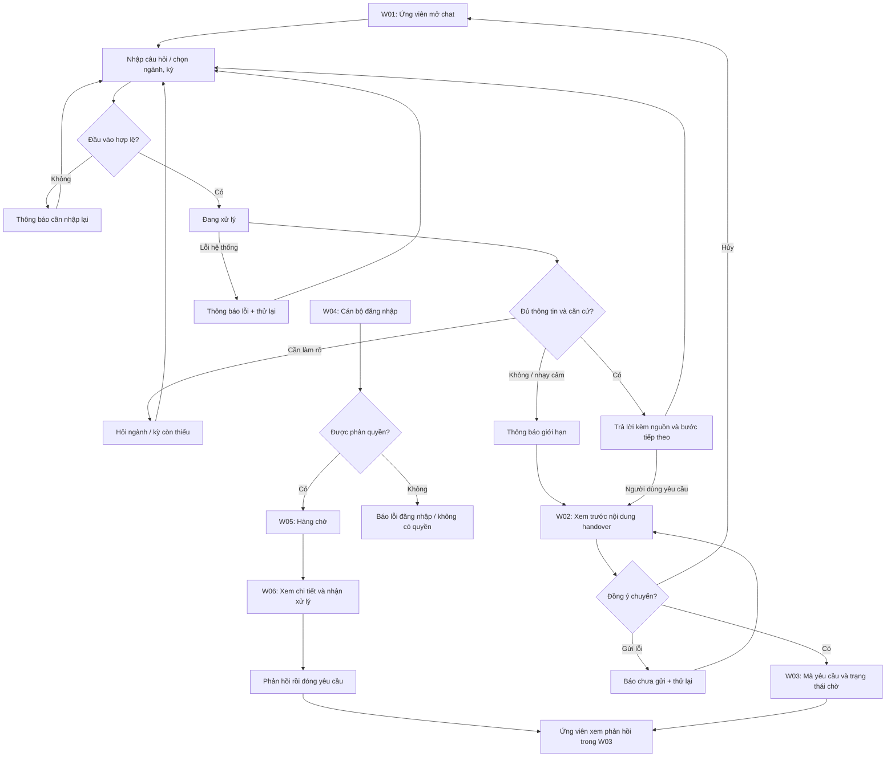

# UI Flow — EDU-12
Nhóm 1009 · T051 · Gate G1 · Phiên bản 1.1 · Cập nhật 04/10/2026

Hạn G1 theo đề bài: 20/09/2026, 23:59 (giờ Việt Nam). Đặc tả này đối chiếu [PRD](../prd.md); các màn P0 là phạm vi MVP, P1 là mở rộng sau MVP.

Đây là thiết kế đề xuất, chưa kết nối backend. Mở `index.html` bằng trình duyệt để xem các màn hình và thử thao tác minh họa. Nội dung nguồn, ticket và cán bộ đều là dữ liệu minh họa; không có thông tin tuyển sinh thật.

| Màn hình | Nội dung và hành động | Yêu cầu PRD |
|---|---|---|
| W01 Chat | Gợi ý chủ đề; ngữ cảnh tự chọn; câu hỏi; loading; nguồn; fallback; retry | FR-01–05, FR-08 |
| W02 Handover | Tóm tắt có thể sửa; liên hệ tùy chọn; đồng ý; gửi/hủy | FR-06 |
| W03 Theo dõi | Ticket và trạng thái chờ/đang xử lý/đã giải quyết; phản hồi | FR-06–07 |
| W04 Đăng nhập | Tài khoản cán bộ; lỗi xác thực; không có quyền | FR-07 |
| W05 Hàng chờ | Danh sách tối thiểu, trạng thái, hàng chờ trống | FR-07 |
| W06 Chi tiết | Tóm tắt đã đồng ý chia sẻ; nhận xử lý; phản hồi; đóng | FR-07 |

## Cách duyệt prototype
1. Ở Chat, chọn trạng thái minh họa rồi gửi một câu hỏi. Các trạng thái không gọi AI.
2. Chọn “Chuyển cán bộ”, xem/sửa tóm tắt, đánh dấu đồng ý rồi gửi để thấy mã yêu cầu.
3. Mở “Cán bộ”, vào hàng chờ demo, nhận xử lý, nhập phản hồi và đóng.
4. Mở “Theo dõi” để xem trạng thái/phản hồi được cập nhật trong bộ nhớ trang.

Prototype không xác thực thật, không lưu dữ liệu sau tải lại, không gửi mạng. Bản sản phẩm phải thực thi phân quyền server và chính sách lưu trữ trong PRD. Link nguồn chính thức và SLA cán bộ chỉ được bổ sung khi trường xác nhận.

## Đặc tả màn hình và trạng thái P0

| Màn hình | Bố cục và dữ liệu | Quy tắc tương tác/ngoại lệ |
|---|---|---|
| W01 Chat | Lời chào và giới hạn; ngữ cảnh tự chọn; lịch sử hỏi đáp; ô nhập; gửi; chuyển cán bộ; xóa ngữ cảnh | Trống: báo tại ô nhập. Đang xử lý: chặn gửi trùng. Quá 2.000 ký tự: yêu cầu rút gọn. Lỗi/timeout: thử lại hoặc chuyển, không giả câu trả lời. Xóa ngữ cảnh giữ ticket đã gửi và phải nói rõ |
| W01a Nguồn | Dấu [1] bên cạnh khẳng định; tên nguồn, mục/trang, kỳ, ngày xác minh, URL chính thức | Mở nguồn bằng liên kết có tên rõ; không gắn nguồn không hỗ trợ câu trả lời. Nguồn không mở được: báo lỗi và đề nghị cán bộ nếu không kiểm tra được, không tự thay bằng URL khác |
| W01b Checklist | Các bước/giấy tờ từ nguồn, mục tự đánh dấu, link cổng hồ sơ | Không đánh dấu là đã nộp thật. Thiếu kỳ/ngành thì hỏi làm rõ; thiếu nguồn thì không sinh checklist. Link chính thức chỉ bật khi được xác minh |
| W02 Xác nhận handover | Lý do chuyển; tóm tắt sửa được; phần ngữ cảnh sẽ chia sẻ; liên hệ tùy chọn; checkbox đồng ý mặc định tắt | Cho loại dữ liệu không muốn chia sẻ. Chưa đồng ý/nội dung trống: không gửi. Đang gửi: chặn gửi trùng. Thất bại: nói chưa tạo yêu cầu; retry không tạo trùng. Hủy về chat giữ câu hỏi |
| W03 Theo dõi | Mã yêu cầu, thời điểm, trạng thái, phản hồi cán bộ, quay lại chat | Rỗng/chờ/đang xử lý/đã giải quyết/lỗi tải/hết phiên có thông báo riêng. Mã ticket không phải khóa truy cập. Không hứa giờ phản hồi khi chưa có SLA |
| W04 Đăng nhập | Nhãn tài khoản/mật khẩu, đăng nhập, thông báo lỗi | Đăng nhập sai: thông báo chung không tiết lộ tài khoản tồn tại. Hết phiên: đăng nhập lại, không để lộ nội dung ticket; thiếu quyền: chặn truy cập |
| W05 Hàng chờ | Mã, thời điểm, lý do, trạng thái, người nhận; lọc trạng thái; xem chi tiết | Rỗng/loading/lỗi tải có trạng thái riêng. Danh sách không hiện liên hệ/hội thoại đầy đủ. Ticket mới mặc định chờ; cán bộ chỉ thấy hàng chờ được cấp quyền |
| W06 Chi tiết | Nội dung được đồng ý chia sẻ, nguồn liên quan, người nhận, phản hồi và thời điểm | Nhận xử lý phải thành công trước sửa/gửi phản hồi. Tranh chấp người nhận: báo đã có người xử lý. Nội dung phản hồi trống/lỗi gửi: không đóng; giữ nháp tại màn hình. Đã đóng: chỉ đọc |

Nguồn và checklist là vùng thành phần của W01, không thêm một vai trò quản trị hoặc một sản phẩm nhận hồ sơ. Trên mobile, chat dùng một cột; vùng nguồn/checklist mở thu gọn. Bàn phím đi theo thứ tự ngữ cảnh → hội thoại/nguồn → ô nhập → hành động; focus về thông báo hoặc tiêu đề màn sau chuyển màn. Trạng thái dùng văn bản, không chỉ dùng màu; thông báo tải/lỗi cần hỗ trợ trình đọc màn hình.

## Vòng đời handover và quyền thao tác

| Trạng thái | Ứng viên | Cán bộ | Chuyển trạng thái |
|---|---|---|---|
| Chưa gửi | Sửa, đồng ý hoặc hủy | Không thấy nội dung | Gửi thành công → waiting |
| waiting — Đang chờ | Xem yêu cầu trong phiên sở hữu | Nhận xử lý | Nhận độc quyền thành công → in_progress |
| in_progress — Đang xử lý | Xem trạng thái | Người nhận phản hồi; chỉ đóng khi đã có phản hồi | Lưu phản hồi và đóng thành công → resolved |
| resolved — Đã giải quyết | Đọc phản hồi; hỏi câu mới trong chat | Xem lịch sử, không sửa ticket đã đóng trong MVP | Câu hỏi mới cần xử lý tạo yêu cầu mới |

Không đồng ý thì không tạo ticket. Hết phiên không cho truy cập bằng mã công khai; nếu không có liên hệ tùy chọn, MVP không khôi phục phản hồi. “Xóa ngữ cảnh” chỉ xóa ngữ cảnh chat; xóa dữ liệu ticket đã gửi được đề nghị với cán bộ theo chính sách PRD. Handover không đồng nghĩa đồng ý nurture.

## Luồng nâng cao P1 (chưa thuộc prototype P0)

| Luồng | Điểm vào và nội dung | Điều kiện |
|---|---|---|
| Hồ sơ tự nguyện | Từ chat: lưu ngành/bậc/kỳ quan tâm, sửa/xóa | Đồng ý lưu riêng; không hỏi CCCD/đặc điểm nhạy cảm để tư vấn |
| Nurture | Sau checklist: chọn kênh và nhận nhắc, rút đồng ý | Mặc định tắt; tối đa 1 nhắc/tuần theo đề xuất PRD; không hứa trúng tuyển |
| Engagement cán bộ | Thống kê tổng hợp click nguồn/link và hoàn tất checklist | Có mẫu số/khoảng đo; click không phải bằng chứng nộp hồ sơ |

## Kịch bản review G1 và nghiệm thu UX sau triển khai

| Kịch bản | Kết quả kỳ vọng | Minh chứng trong prototype hiện có |
|---|---|---|
| Hỏi câu hợp lệ và xem nguồn | Trả lời có nguồn và bước tiếp theo | Chế độ có căn cứ hiển thị khung, không có đáp án/URL thật |
| Thiếu ngành/kỳ | Hỏi làm rõ, không đoán | Chế độ làm rõ |
| Thiếu nguồn/yêu cầu nhạy cảm | Nêu giới hạn, đề nghị cán bộ | Chế độ fallback |
| Lỗi AI | Thông báo chưa có trả lời, có đường thử lại | Chế độ lỗi |
| Chuyển nhưng không đồng ý | Không tạo yêu cầu | Bỏ checkbox, bấm gửi để xem lỗi |
| Chuyển hợp lệ, cán bộ nhận và đóng | Theo dõi cập nhật phản hồi/trạng thái | W02 → W03 → W04 → W05 → W06 → W03 |
| Xóa ngữ cảnh sau tạo ticket | Ngữ cảnh trống, ticket còn trong Theo dõi | Nút xóa ngữ cảnh |
| Hết phiên/quyền sai/gửi lỗi/tranh chấp người nhận | Bảo vệ dữ liệu và trạng thái nhất quán | Chỉ được đặc tả; phải kiểm chứng ở MVP |

HTML hiện có là minh họa tương tác tối giản, hỗ trợ một ticket mỗi lần mở trang và gộp gửi phản hồi với đóng. Checklist, lọc hàng chờ, liên hệ ngoài phiên và các trạng thái lỗi vận hành mới là đặc tả, chưa được mô phỏng đầy đủ. Review G1 kiểm tra tính đầy đủ/nhất quán của thiết kế; không dùng thao tác demo để kết luận phân quyền, RAG hay KPI đã đạt.
